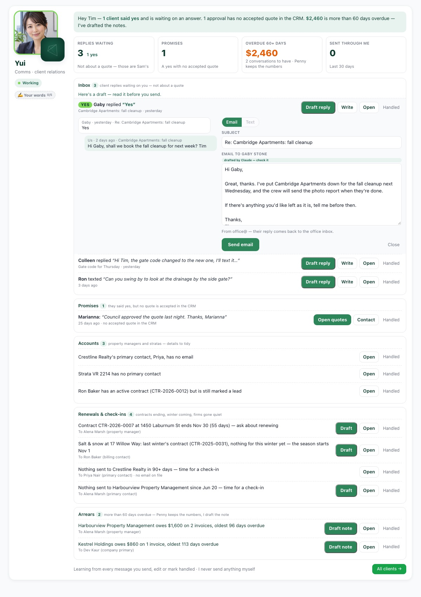

# Yui — the comms / client relations head

Yui's job: every one-to-one conversation with **existing** clients. She sits in the
department heads deck on the dashboard (`public/crm/includes/yui-card.php`). **Yui never
sends anything herself** — she drafts, Tim edits and sends, exactly like Sam's follow-ups.

Who owns what: Sam keeps quotes and new leads · Mia keeps campaigns, consent, reviews and
referrals · Penny keeps money · Otto keeps properties · Yui keeps the conversations.

## Her five sections

| Section | What's in it | Buttons |
|---------|--------------|---------|
| **Inbox** | Client replies nobody answered that are **not about a quote** — `UnclaimedReplyService`'s `client` lane. A clear yes (`isYes()`) is flagged YES and ranked first. | Draft reply (Claude) · Write · Open · Send · Handled |
| **Promises** | An inbound "yes / council approved / approved the quote / go ahead / please proceed" (`YuiRules::isPromise`) from a contact with **no quote accepted after it** — for them, their site/quote property, or their firm. Skips replies the inbox or Sam's "waiting on you" already shows. | Open quotes · Contact · Handled |
| **Accounts** | PM firms and stratas (`company_type` property_manager/strata, or named as a building's `property_manager_id`): no contacts · no primary · primary/billing contact with no email · PM-managed building (active contract or a quote in the last year) with no quote contact and no strata rep/PM person · contact on an active contract still at lifecycle `lead`. Read-only — nothing is fixed for you. | Open · Handled |
| **Renewals & check-ins** | Contracts ending within 60 days · last winter's salt/snow contract (title or quote service type) with nothing for this winter, shown 45 days before Nov 1 (skipped if a winter quote was made — Sam is on it) · PM firms with no outbound message in 90 days (only once `sales_messages` reaches back that far; skipped while Mia has a `pm_quiet` note out). | Draft · Open · Send · Handled |
| **Arrears** | Invoices more than 60 days overdue, one conversation per payer. Written to the building's property manager, else the company primary, else the billing contact — an accountant (`contact_role = billing_contact`) only when they ARE the billing contact. Penny keeps the numbers; Yui drafts the conversation. | Draft note · Open · Send · Handled |

Pure decisions: `app/Modules/Comms/Services/YuiRules.php` (unit tested,
`tests/Unit/Comms/YuiRulesTest.php`). Reads: `YuiDeskService` — each section fails on its own.

## Sam ↔ Yui: one source, never twice

`UnclaimedReplyService` puts each unanswered reply in exactly one lane: a reply whose subject
or text names a quote / estimate / proposal stays Sam's (`quote_reply`, `sam:reply:…`),
everything else is Yui's (`client_reply`, `yui:reply:…`). Sam's brief no longer carries
`unclaimed_reply`. A "Handled" under either prefix hides the reply, so Sam's old dismissals
still count.

## Drafts and sending

- Inbox: **Draft reply** asks Claude (`claude-sonnet-5-5`) on Tim's click only, max 20 a day,
  with `app/Services/Copy/mowology-copy-rules.md` as the system prompt, the thread from
  `sales_messages` and Tim's last three sent emails. Tokens recorded in `yui_actions`.
- Renewal / season / check-in / arrears: a template in Tim's voice. When he edits and sends
  one, his version (client details put back as `{placeholders}`, grammar words left alone)
  becomes the next draft for that template ("written your way").
- `sendEmail()` / `sendSms()` only (CLAUDE.md rule 9). Email from office@ (Reply-To office@),
  Tim's words in `EmailWrapper`, no links. Text only with SMS consent and only if ≤160
  characters, no links, no special characters, includes (778) 846-9273 and points them to
  their email (rule 11 — checked in the browser and on the server).
- The server re-reads the item by key, so the recipient comes from the CRM, not the browser.
- Each send is logged to `sales_messages` (mailbox `yui`, so the reply counts as answered)
  and `yui_actions` (sent unchanged vs edited). Renewal/check-in/arrears items rest 14 days
  after a send. **Handled** writes `yui_actions` and dismisses Charlie's copy.

## Charlie, the Action Board, brain and badges

- `YuiDeskService::brief()` is registered in `CharlieBriefService` (head `yui`). Order and
  priority: yeses and promises (1) → arrears (2, with $) → other replies (2) → accounts (3) →
  renewals (3; 2 when a contract ends within 14 days). Stable keys: `yui:reply:<contact>:<hash>`,
  `yui:promise:<contact>:<hash>`, `yui:account:<flag>:<id>`, `yui:renewal:ending:<contract>`,
  `yui:renewal:season:<property>:<year>`, `yui:checkin:<company>`, `yui:arrears:<payer>`.
  The brief works before migration 1191; Charlie dismiss/snooze on `yui:%` keys is honoured.
- Action Board: `yui` → `/crm/img/heads/yui.jpg`.
- Brain (`YuiBrainService` → `HeadBrain`): drafts sent as written, drafts rewritten, templates
  written Tim's way, items cleared, badges. Badges (`YuiBadgeService`): Your words (last 5
  sent unchanged), On it (10 sent), Tidy (10 handled).

## API, data, deploy

- `/crm/api/yui.php` (shim → `app/Modules/Comms/Api/yui.php`): `?mode=desk|brief`; POST
  `draft` / `send` / `handled` (CSRF checked). `?mode=`, never `?action=`. Permission
  `billing.edit` (same as Sam).
- Migration **1191** (`yui_actions`): drafts, sends, handled. The card renders nothing until
  it has run.
- Files: `app/Modules/Comms/**`, `public/crm/api/yui.php`, `public/crm/includes/yui-card.php`,
  `public/crm/js/yui-card.js`, `public/crm/img/heads/yui.jpg`, the Yui section of
  `mowology-brand.css`, plus the Sam split (`UnclaimedReplyService`, `SalesDeskService`,
  `sam-card.js`) and the head registries (`CharlieBriefService`, `CharlieRankService`,
  `action-board.js`, `charlie-inbox.js`, `dept-heads-deck.php`). Deploy them together: the
  Sam split without Yui would drop client replies from Charlie's list.
