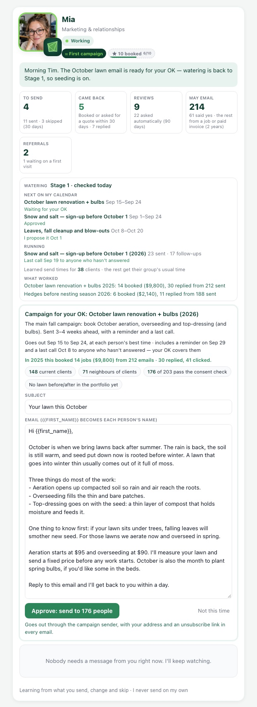

# Mia as HubSpot — email

Mia's email side: a year-round campaign calendar, a daily check of the Metro Vancouver watering
stage, reminders and last calls to people who haven't answered, each person's best send time,
and results by year. She still only **proposes**. Nothing sends until Tim approves on her card,
and one approval covers the whole sequence.

## What Tim sees

On Mia's card, under her numbers:

- **Watering**, e.g. `Stage 1 · checked today`. In Stage 2/3 it adds "No lawn watering ·
  lawn-seeding emails held".
- **Next on my calendar**: the next 3 campaigns with their send windows and state. The state
  is one of: Waiting for your OK, Approved, `I propose it Oct 1`, or `Held: Stage 2 watering
  restrictions…`.
- **Running**: approved campaigns whose reminder or last call is still to come.
- **Learned send times for N clients**.
- **What worked**: the campaigns that booked best, by year.

The proposal box (unchanged flow: edit, Approve twice, or Not this time) also shows:

- "Goes out Sep 15 to Sep 24, at each person's best time · includes a reminder on Sep 29 and a
  last call Oct 8 to anyone who hasn't answered — your OK covers them";
- last year's result for the same campaign;
- any copy flags.

Charlie still gets a proposal waiting for approval as a priority-1 item (`MiaDeskService::brief`,
unchanged).

## The calendar (`mia_calendar`, seeded by migration 1195)

Tim can edit the dates, words and conditions in the table. `MiaCalendar::defaults()` holds the
same seed, and a test checks that the two match.

Dates are MM-DD. Mia proposes on `propose_on`, about 7 days before the send window. A proposal
nobody decides lapses when its window ends.

| Key | Audience | Proposed | Sends | Follow-ups |
|---|---|---|---|---|
| spring_early_bird | homeowners | Jan 5 | Jan 12–23 | reminder +10 d |
| spring_holds | people who replied "spring" | Jan 5 | Jan 12–30 | reminder +10 d |
| hedge_before_nesting | all clients | Feb 1 | Feb 8–20 | reminder +9 d |
| spring_lawn_main (aerate/overseed/top-dress/lime) | homeowners | Feb 17 | Feb 24–Mar 6 | reminder +12 d |
| spring_lawn_last_chance ("seed by mid-April") | homeowners who didn't answer the main one | Mar 10 | Mar 17–25 | — |
| moss_lawn_care | homeowners | Mar 31 | Apr 7–18 | — |
| beds_mulch (whole yards, 2-yard min) | homeowners | Apr 24 | May 1–12 | reminder +10 d |
| pm_snow_preseason | PMs + stratas | Jun 8 | Jun 15–Jul 10 | — |
| fall_lawn_homeowners (leaf-heavy lawns skipped) | homeowners | Aug 8 | Aug 15–26 | reminder +10 d |
| hedges_post_nesting | all clients | Aug 10 | Aug 17–31 | — |
| pm_snow_signup (before Oct 1) | PMs + stratas | Aug 25 | Sep 1–24 | reminder +10 d |
| fall_lawn_main (book October + bulbs) | all clients | Sep 8 | Sep 15–24 | reminder +14 d, last call +23 d |
| post_drought (the v1 campaign, words unchanged) | all clients | Oct 1 | Oct 1–31 | — (only in a Stage 2/3 summer) |
| fall_cleanup (leaves, blow-outs) | all clients | Oct 1 | Oct 8–20 | reminder +12 d |
| pm_next_year (strata budgets / AGM) | PMs + stratas | Nov 3 | Nov 10–28 | reminder +14 d |

**Audiences:**

- `all_clients` is the v1 audience: an active plan or a visit in the last 12 months, plus
  neighbours within 400 m.
- `homeowners` is that list minus PM and strata contacts.
- `property_managers` are the primary or billing contacts of `property_manager` companies, and
  of the companies on `properties.property_manager_id`.
- `stratas` are the contacts of `strata` companies, and the site contacts of strata
  properties.
- `past_seed` are accepted seed quote lines or seed plans in the last 24 months.
- `spring_holds` are "Booked for spring" answers, plus "spring" replies to campaigns.

Every audience then goes through the v1 leave-outs: Sam's open quotes, "never" mutes, test
contacts, no email, and the consent ledger.

**Conditions (`conditions_json`):**

- `lawn_seeding`, and `requires_restriction_stage_max: 1`: held in Stage 2/3, or when the
  stage is unknown during the season.
- `requires_drought_year`: only after a summer that reached Stage 2+.
- `skip_if_leaf_heavy`: leaves out properties that had a completed leaf cleanup last Oct–Dec.
  Their seed waits for spring.
- `exclude_responders_of`: leaves out anyone who replied to, was quoted after, or booked from
  the named campaign this year.
- `stage_aware`: in Stage 2+, flags the copy so it points people to the dormant-lawn page.

**Copy rules:**

- The wording follows Tim's voice: first person, signed Tim, no exclamation marks, no
  discounts.
- Prices are `{price:aeration}` style tokens, filled at proposal time from `products`. The
  lowest `min_price` is used, or `base_price` when there is no `min_price`.
- If the CRM has no price for a service, the token stays in the text and approval is refused
  until Tim writes the price in.
- `MiaCampaignService::problems()` now also takes the stage. From Stage 2 it refuses any
  sentence that ties watering, sprinklers, irrigation or hoses to a lawn, grass, seed or sod.
  "Watering restrictions" and irrigation blow-outs are fine.

## Watering stage (`WaterRestrictionService`)

- The daily cron fetches <https://metrovancouver.org/services/water/water-restrictions> (20 s
  timeout, its own user agent).
- It strips scripts first, because the page carries "Stage 3" in a search script, then reads
  `Stage N water restrictions in effect`.
- If that fails, it falls back to Burnaby's page
  (`/services-and-payments/water-and-sewers/watering-restrictions`), which says "returned to
  stage N".
- The result is stored in `ops_settings.mia_water_restriction` as JSON: stage, checked_at,
  source, snippet, last_attempt_at, error, season_year and season_max.
- A failed fetch never overwrites the last good stage.
- Outside May 1–Oct 15 the stage is 0 / none.
- The test fixtures are a trimmed copy of the real pages fetched on 2026-10-06 (Stage 1), plus
  synthetic Stage 2, Stage 3 and no-stage pages.

## Sequences (`MiaSequenceService`)

- The follow-up words are frozen into `mia_campaigns.sequence_json` when Mia proposes.
- Each person's follow-up is due N days after *their* main email. It goes only if they have not
  replied (inbound `sales_messages`), been quoted, booked (accepted quote or new plan) or
  unsubscribed, and only if they still pass the consent ledger.
- It is never sent more than 7 days late.
- A follow-up is its own `marketing_campaigns` row, so the sender uses its shorter words
  unchanged. Its `campaign_sends` rows carry `step`, `parent_send_id` and `scheduled_at`.
- The sender still re-checks `canSendMarketing()` when it sends.
- `replied_at` and `booked_at` are stamped nightly on the main sends.

## Send times (`SendTimeService`)

- **Evidence weights:** a reply counts 3, a click 2, and a believable open 0.5.
- **Opens that don't count:** opens with the bare `Mozilla/5.0` user agent (Apple Mail Privacy
  Protection proxy), with an empty user agent, or within 2 minutes of the send.
- **When a time is learned:** once a contact has 3 points of evidence, their best weekday and
  hour go into `mia_send_times`, recomputed nightly.
- **Defaults otherwise:**
  - property managers and stratas: Tue–Thu 9:30 (`ops_settings.mia_send_default_pm`);
  - homeowners: Tue/Wed 7:30 pm or Sat 9:00 (`mia_send_default_home`).
- **Scheduling:** approval writes each send's `scheduled_at` for the next learned slot inside
  the send window. If none fits, the default slot is used, and failing that the window's start.
- **Sender:** `campaign_sender` only sends rows whose `scheduled_at` has come (20 per 15
  minutes, as before). It doesn't mark a campaign finished while sends are still waiting.
- **Tracking:** `track-open.php` and `track-click.php` now also log every open and click with
  its time and user agent to `campaign_events`, at most 20 of each per send. The first
  `opened_at` and `clicked_at` behave as before.

## Results by year

`mia_calendar_results` holds sent, clicked, replied, quoted, booked and booked $ for each
`calendar_key` and year. `results()` has the same definitions: bookings first, and opens are not
kept. The v1 `post_drought_2026` row is back-filled to calendar key `post_drought`, so its
history carries on.

## Deploy (Tim)

1. Files:
   - `app/Modules/Marketing/Services/` — `MiaCalendar.php`, `WaterRestrictionService.php`,
     `SendTimeService.php`, `MiaSequenceService.php`, `MiaEmailHubService.php` (all new) and
     `MiaCampaignService.php`;
   - `app/Modules/Marketing/Cron/` — `mia_email_daily.php` (new) and `campaign_sender.php`;
   - `public/crm/cron/mia_email_daily.php` (new);
   - `public/crm/api/track-open.php` and `track-click.php`;
   - `public/crm/includes/mia-card.php`, `public/crm/js/mia-card.js` and
     `public/crm/css/mowology-brand.css`;
   - `public/crm/database_appstack.php` (cron registry).

   Three-way merge `mia-card.*`, `MiaCampaignService.php`, `mowology-brand.css` and
   `database_appstack.php` against live first: other sessions edit them.
2. Run migration **1195_mia_email_hub.sql** once. It uses plain ALTERs, so a second run fails
   on the duplicate columns.
3. Reset OPcache.
4. Add the cPanel cron: `20 5 * * * /usr/local/bin/php /home/mowology/public_html/app/Modules/Marketing/Cron/mia_email_daily.php`
5. Click "Run now" once in Database → Cron Jobs, to read today's stage.

Before migration 1195 runs, the code is guarded: Mia proposes the v1 campaign as before, the
sender ignores `scheduled_at`, the tracker skips `campaign_events`, and the card hides the hub.

## Not done / unverified

- Nothing has run against MySQL: the tests use SQLite. The SQL is written to be safe on MySQL
  5.7 and 8.
- The Apple MPP user-agent filter rests on the widely reported bare `Mozilla/5.0` proxy user
  agent, plus the 2-minute rule. It is not verified against our own logs yet.
- The PM, strata and past-seed audiences depend on `companies.company_type`,
  `properties.property_manager_id` / `property_type` and `quote_line_items` being filled in
  live. They are best-effort: a missing column means an empty segment, not an error.
- Leaf-heavy detection is a proxy (a leaf cleanup last fall). There is no per-property tree
  flag.
- Strata fiscal year-ends are not stored per company yet. `pm_next_year` asks PMs for them.
