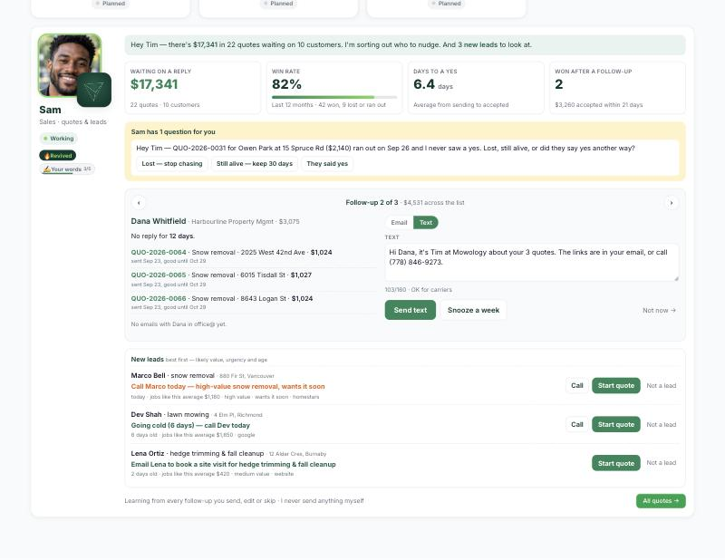
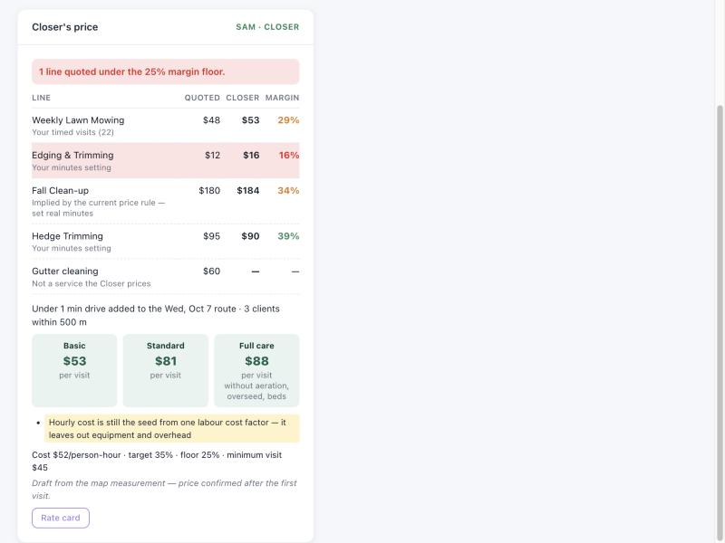

# Sam — the sales head

Sam's job: more quotes accepted, no lead forgotten. He sits in the department heads deck on
the dashboard (`public/crm/includes/sam-card.php`), under Penny. **Sam never sends anything
himself** — every follow-up is Tim's click.



## What he shows

| Part | Source |
|------|--------|
| Numbers: $ waiting, win rate, days to a yes, won after a follow-up | `SalesDeskService::stats()` |
| Follow-up carousel — one card per **customer** (a property manager with ten quotes gets one note) | `SalesDeskService::queue()` → `groupStale()` |
| Suggested email + text for each card | `SamFollowupService::draft()` |
| New leads, best first, each with "what to do next" | `SalesDeskService::leads()` → `rankLeads()` |
| Questions for Tim (quotes that ran out) | `SamQuestionService` |
| Badges, brain | `SamBadgeService`, `SamBrainService` → shared `app/Services/HeadBrain.php` + `public/crm/js/head-brain.js` |

API: `/crm/api/sales-head.php` (shim → `app/Modules/Sales/Api/sales-head.php`), `?mode=desk`,
POST `send` / `park` / `draft_reply` / `answer` / `lead_dismiss`. Permission `billing.edit`.

## When is a quote "waiting"?

- Status `sent` or `viewed`, still inside `valid_until`, not a test record (`ZZTEST`).
- Grouped by customer (`COALESCE(quotes.contact_id, properties.site_contact_id)`).
- Due when the **last touch** — quote sent, follow-up (`quotes.follow_up_sent_at`), an
  office@ email to them, a send through Sam — is older than the wait: the median days to
  accept for that service once 5+ quotes were accepted (clamped 3–14), else the
  `ops_settings` `sam_stale_days` (default 5).
- **The customer wrote back after our last email → "Waiting on you"**, shown first, even
  inside the wait and even after 3 follow-ups.
- At most 3 follow-ups. Snooze / "Not now" hides the customer for 7 days.
- Past `valid_until` → a question instead: lost (→ status `expired`), keep (+30 days), or
  won another way (opens the quote to record the yes).

Dollars: `COALESCE(NULLIF(total_amount, 0), amount)` — writers fill one or the other.

## Drafts, and how Sam learns

- Templates per situation: `first_nudge`, `second_nudge`, `viewed`, `last_call`, `multi`,
  `reply` — written with the copywriting skill and the voice card in
  `.agents/product-marketing-context.md` (no exclamation marks, never "just checking in",
  one easy ask, snow quotes say why now once).
- When Tim edits and sends, his version is stored with the customer's details put back as
  `{placeholders}` (`sam_followups.learned_body`) and becomes Sam's draft for that situation
  next time ("written your way").
- A follow-up "won" if one of its quotes was accepted within 21 days — the scorecard behind
  "Won after a follow-up", the Revived/Closer badges and the brain.
- **Draft a reply** (only when the customer wrote back): Claude, on Tim's click only, max 20
  a day, with `app/Services/Copy/mowology-copy-rules.md` as the system prompt plus the
  quotes, the thread and Tim's last three sent emails. Tokens recorded on the row.

## Sending

`sendEmail()` / `sendSms()` only (CLAUDE.md rule 9). The server re-reads the card, so the
address and quotes come from the CRM, not the browser. Email: Tim's text + a link to each
quote (customer portal token), wrapped by `EmailWrapper`. Text: only with SMS consent, and
refused unless ≤160 characters, no links/domains, no special characters (rule 11 — checked
in the browser and again on the server). Each send updates `quotes.follow_up_sent_at/count`,
the activity log, `sam_followups` and `sales_messages`.

The nine automatic quote follow-up `automation_rules` (ids 2, 6, 10, 14, 18, 22, 26, 30, 34)
were switched off on 2026-10-05 at Tim's request — Sam is the only follow-up path. Seven of
them were duplicates of the same rule, each had fired 132 times.

## Conversation history (office@, read-only)

`app/Modules/Sales/Cron/sales_inbox_poll.php` (every 15 min, registry key
`sales_inbox_poll`) reads office@ INBOX + Sent with `OP_READONLY` / `FT_PEEK` — it never
marks, moves or deletes mail. Only mail from or to a known contact email is kept, and only
the new text (quoted history stripped, ≤800 chars) in `sales_messages`. First run backfills
90 days. Tim's personal mail is not read. Texts are covered by the bridge below.

## Texts (iMessage bridge)

Customers text Tim's phone. `tools/messages-bridge/bridge.py` runs on Tim's Mac (launchd,
every 5 min, Python 3.9 stdlib) and opens the Messages database **read-only** (`?mode=ro`).

- **One-to-one chats only** — any chat with more than one handle is skipped. Tapbacks
  (`associated_message_type != 0`) and attachment-only messages are skipped.
- **Matching never exposes a number.** `GET ?mode=numbers` returns a server salt
  (`ops_settings` `text_bridge_salt`, made on first use) and `sha256(salt + last 10 digits)`
  for every active, non-ZZTEST contact's `phone` / `mobile` — no ids, no numbers. The Mac
  hashes each conversation's number the same way; **only matches are sent**. Texts with
  anyone else are never sent, logged or printed.
- `POST mode=ingest` (≤500 per call): `{hash, direction: in|out, sent_at (unix), guid, text}`
  → `sales_messages` with `mailbox 'imessage'`, `channel 'sms'`, `message_key 'imsg-'+guid`
  (re-sends are ignored), `from_addr`/`to_addr` = `'text'` (the number is not stored),
  snippet ≤800 chars. Unknown hashes are rejected.
- `POST mode=heartbeat` every run (counts only) → `ops_settings` `text_bridge_heartbeat`.
  The desk response carries `texts` (`TextBridgeService::status()`); after 60 silent
  minutes Sam's card says the Mac hasn't sent texts.
- Sam's thread labels them "text"; a customer's text counts as "wrote back" exactly like
  an email, and Tim's own texts from his phone count as our last touch. Mia's reply counts
  read inbound `sales_messages` without a channel filter, so texts count there too.

Endpoint: `/crm/api/text-bridge.php` (shim → `app/Modules/Sales/Api/text-bridge.php`), no
session — bearer token compared with `hash_equals` against `SALES_TEXT_BRIDGE_TOKEN` in
`secrets.php` (also accepted as `X-Bridge-Token` for hosts that strip `Authorization`).
Undefined or shorter than 32 characters → 503 "not configured".

Setup (Tim): see `tools/messages-bridge/README.md` — token (`openssl rand -hex 32`) in
`secrets.php` and in `~/Library/Application Support/mowology-bridge/token` (chmod 600),
Full Disk Access for Terminal and `/usr/bin/python3`, `--dry-run`, then `install.sh`.

## Setup

1. Migration `database/migrations/1140_sales_head.sql` (Database → Migrations). Until it
   runs the card renders nothing.
2. cPanel cron: `0,15,30,45 * * * * /usr/local/bin/php /home/mowology/public_html/app/Modules/Sales/Cron/sales_inbox_poll.php`
3. OPcache reset after deploying.

## Tests

`tests/Unit/Sales/*` and `tests/Unit/Core/HeadBrainTest.php`. The bridge:
`cd tools/messages-bridge && /usr/bin/python3 -m unittest discover -s tests` (synthetic
chat.db only; the hash test vector is shared with `TextBridgeServiceTest`).

---

# Sam the Closer: rate card and price (step 1)

Sam's title is now **Closer**. On every quote (`quotes/view.php`, right column) he shows
**his price beside the quote's own price**, and flags any line whose quoted price earns
less than the margin floor. **He never replaces a price and never changes a rate.** The plan
behind this is in `docs/crm/sam-closer-pricing-plan.md`.



```
visit price = max(minimum, ((site minutes + drive minutes added) × hourly cost
                            + materials + disposal) / (1 − target margin))
```

| Input | Where it comes from |
|---|---|
| Hourly cost | `ops_settings.closer_hourly_cost`. This is the cost of one **person**-hour, not a charge-out rate. No `cost_factors` row is a fully loaded cost per hour, so migration 1141 seeds it from the closest one: the Owner/Manager labour row's burdened rate, or failing that the highest labour rate. The card flags it as "still the seed" and shows a suggested fully loaded figure (labour + walk-behind/trimmer/blower/truck per hour + monthly overhead ÷ billable hours) until Tim saves his own value. |
| Target margin | `overhead_settings.profit_margin`, the existing 35%. It is not duplicated. |
| Margin floor | `ops_settings.closer_margin_floor_pct`, seeded at target − 10 (25%). |
| Minimum visit | `max(closer_min_visit, the product's own min_price)`. `closer_min_visit` is seeded from the lowest mowing product `min_price`. |
| Site minutes | `SiteMinutesModel`: fixed + per-unit (per 1,000 ft² lawn, per 100 ft of edge or hedge) + per-obstacle. It uses the weekly **fit** once a service has 15 good timed and measured visits. Below that it uses **Tim's minutes**, and failing those the minutes **implied by the current `QuoteCalculator` price rule** (labelled so nobody mistakes it for data). With none of these the line shows "needs minutes". |
| Drive minutes added | `DriveMinutesAdded`: the cheapest insertion into a route day within ±28 days of `calendar_stops` (with the depot at both ends), × 1.4 detour at 40 km/h, which is the Might-E figure route-engine.js uses. With no route day it is a round trip from the depot, and with no depot it is not counted. Drive minutes are multiplied by the crew size. Only the first per-visit line carries them. |
| Depot | `closer_depot_lat/lng` if Tim set a yard; otherwise `business_settings.company_address`, geocoded once and cached. A failed geocode is retried at most once a day. |
| Materials, disposal | The product's `base_cost`, plus a `cost_factors` row named like "disposal", "dump fee" or "tipping" on cleanup, hedge and bed work. If there is no such row, disposal counts as $0 and the card says so. |
| Tiers | Basic, Standard and Full care map to `product_bundles.tier` good/better/best. With no bundles, Basic is mow, Standard is + edging + cleanup, and Full care is + aeration, overseeding, hedge and beds. Seasonal work is spread per visit using `closer_season_plan` (28 visits, 2 cleanups, 1 aeration, 1 overseed, 2 hedge, 4 bed visits). |

**Cleaning the timer data** (`SiteMinutesModel::visitMinutes`):
- Drive and purchase entries are dropped.
- One person's overlapping entries are merged.
- Two people count twice for cost; they are divided only to report crew size.
- Visits with cluster-apportioned or photo-inferred time are left out, because they are
  allocations, not measurements.
- Visits shorter than 5 minutes or longer than 600 are ignored.

**Weekly recalibration** is `app/Modules/Sales/Cron/closer_recalibrate.php` (registry key
`closer_recalibrate`, Mondays 4:15). It writes only `closer_site_models` 'fit' rows. Each row
also records the margin actually earned per service over the last 56 days, using the timer
minutes rather than `visit_margin_snapshots.labor_cost`, which can hold the estimate. That
figure is the drift report, and it is shown on the rate card.

**Rate card form** (admins only, on the Closer card): hourly cost, margin floor, minimum visit
and per-service minutes. It is saved through `CloserSettingsService` and is Tim's click only.

Files:
- **Services**, all in `app/Modules/Sales/Services/`: `CloserPricing.php`, `SiteMinutesModel.php`, `DriveMinutesAdded.php`, `CloserRateCard.php`, `CloserService.php`, `CloserSettingsService.php`.
- **API:** `app/Modules/Sales/Api/closer.php` (shim `public/crm/api/closer.php`): `?mode=quote&id=`, `?mode=card`, POST `save_card`.
- **UI:** `public/crm/includes/closer-panel.php` and `public/crm/js/closer-panel.js`, plus the `.mw-closer-*` styles in `mowology-brand.css`.
- **Migration:** `1141_closer_rate_card.sql`.
- **Tests:** `tests/Unit/Sales/Closer*`, `SiteMinutesModelTest`, `DriveMinutesAddedTest`.

## Closer backtest

`php scripts/closer-backtest.php --fixture` runs on made-up visits. The real run needs two CSVs
exported from production with these **read-only** queries (Database page, logged-in Chrome).
Run them after migration 1141; before it, replace `p.edge_linear_ft` and `p.obstacle_count`
with `0`.

```sql
-- visits.csv
SELECT jv.id AS visit_id, jv.scheduled_date AS date, jp.service_type,
       COALESCE(NULLIF(p.total_lawn_sqft, 0), p.lawn_size_sqft, 0) AS lawn_sqft,
       COALESCE(p.edge_linear_ft, 0) AS edge_ft, COALESCE(p.total_hedge_linear_ft, 0) AS hedge_ft,
       COALESCE(p.obstacle_count, 0) AS obstacles,
       COALESCE(vms.quoted_amount, jp.price_per_visit, 0) AS quoted_amount,
       COALESCE(vms.material_cost, 0) AS materials
FROM job_visits jv
JOIN job_plans jp ON jp.id = jv.plan_id
JOIN properties p ON p.id = jp.property_id
LEFT JOIN visit_margin_snapshots vms ON vms.visit_id = jv.id
WHERE jv.status = 'completed' AND jv.scheduled_date >= '2025-03-01';

-- entries.csv
SELECT jte.visit_id, jte.user_id, jte.start_time, jte.end_time, jte.duration_minutes,
       jte.time_type, jte.cluster_session_id, jte.time_source
FROM job_time_entries jte
JOIN job_visits jv ON jv.id = jte.visit_id
WHERE jte.status IN ('completed', 'edited') AND jv.status = 'completed'
  AND jv.scheduled_date >= '2025-03-01';

-- How much history each service has (timed job minutes only, measured lots)
SELECT jp.service_type, YEAR(jv.scheduled_date) AS yr, COUNT(DISTINCT jv.id) AS visits,
       COUNT(DISTINCT jte.visit_id) AS timed,
       COUNT(DISTINCT CASE WHEN COALESCE(NULLIF(p.total_lawn_sqft, 0), p.lawn_size_sqft) > 0 THEN jte.visit_id END) AS timed_measured
FROM job_visits jv
JOIN job_plans jp ON jp.id = jv.plan_id
JOIN properties p ON p.id = jp.property_id
LEFT JOIN job_time_entries jte ON jte.visit_id = jv.id AND jte.status IN ('completed', 'edited')
     AND jte.time_type = 'job' AND jte.cluster_session_id IS NULL
WHERE jv.status = 'completed'
GROUP BY jp.service_type, YEAR(jv.scheduled_date)
ORDER BY timed_measured DESC;
```

Then run `php scripts/closer-backtest.php --visits=visits.csv --entries=entries.csv --hourly=<cost>`.

## Closer setup (after deploy)

1. Run migration `1141_closer_rate_card.sql`. Until it runs, the card renders nothing.
2. Read the seeded values: `SELECT setting_key, setting_value, description FROM ops_settings WHERE setting_key LIKE 'closer_%'`.
   Confirm or replace the hourly cost on the card's Rate card form.
3. Set up the cPanel cron: `15 4 * * 1 /usr/local/bin/php /home/mowology/public_html/app/Modules/Sales/Cron/closer_recalibrate.php`.
   Run it once by hand from the Cron Jobs tab.
4. Reset OPcache.
