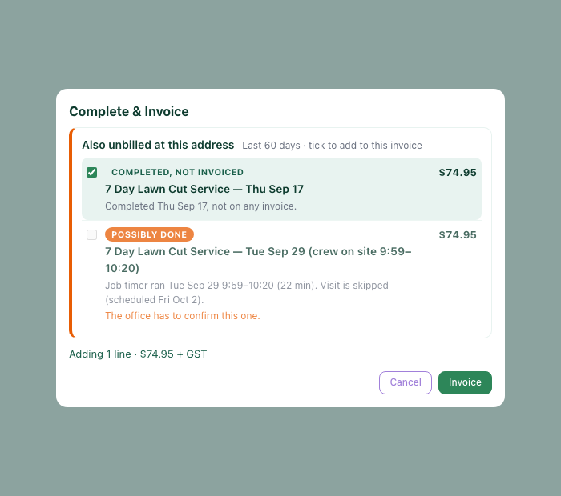
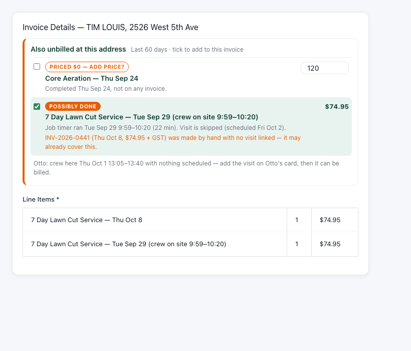

# Also unbilled at this address

**Why (2026-10-08):** Tim invoiced today's cut for TIM LOUIS (2526 West 5th Ave, property 29) and
only then noticed last week's was never billed. The crew ran a 22-minute timer on Tue Sep 29
against visit #2112 (scheduled Fri Oct 2), which was later marked **skipped**, so nothing ever
invoiced it (INV-2026-0441 was raised by hand). The Sep 24 Core Aeration (#2412) was completed
priced $0 and never billed either.

## What it does

Whenever an invoice is raised for a property, the same service — `UnbilledWorkFinder`
(`app/Modules/Invoices/Services/UnbilledWorkFinder.php`) — lists other unbilled work at that
property for the same payer in the last 60 days:

| Kind | Rule | Default |
|---|---|---|
| Completed, not invoiced | completed visit, no invoice link, not on any live invoice | ticked, unless a warning applies |
| Possibly done | skipped / scheduled / cancelled / weather visit with a job timer that day, or Otto's "done that day, not the scheduled day" | never ticked; admin/manager only |
| Priced $0 — add price? | completed visit whose price resolves to $0 | never ticked; needs a price (suggested from the last billed price or the catalog) |

Never offered: contract-billed plans, monthly/seasonal/custom plans, visits already linked to or
on a line of a non-cancelled invoice. Warnings (no pre-tick): a hand-made invoice for the property
dated after the work with no visit linked ("may already cover this"), or another visit of the same
plan already done that day. Otto's open "crew was here with nothing scheduled" items show as hints
(they need a visit first, on Otto's card).

Ticking adds a line with its service date and evidence, e.g.
`7 Day Lawn Cut Service — Tue Sep 29 (crew on site 9:59–10:20)`. On save the visits are claimed
**inside the invoice transaction** (`UnbilledWorkFinder::claim()`): rows re-checked under lock, linked
(`invoice_id`, `is_invoiced`), a possibly-done visit marked completed on the real day (date + stop
moved, timer times, audit note in `completion_notes`, no customer email), a $0 visit given its
price, and a row in `invoice_unbilled_claims` (migration 1290). If anything changed in between the
whole invoice rolls back with a clear message — no double billing.

## Surfaces

- **iOS Complete Visit sheet** (1.3.8) — section "Also unbilled at this address" between the note and
  the buttons: one toggle per line with badge, description (service date), amount (a price field for
  $0 lines), evidence and warnings in small print; "Adding N lines · +$X + GST" under the list; the
  button reads "Complete & Invoice (+N)". Possibly-done toggles are disabled for crew ("The office
  has to confirm this one."). Data: `POST /api/schedule/invoice {action:'unbilled'}`; send:
  `{action:'create', extra_visits:[{visit_id, amount}]}`.
- **Desktop schedule "Complete & Invoice"** — a dialog with the same list before the stop is
  completed (`pow-actions.php complete_stop`, `extra_visits`). Render:
  
- **invoices/create.php** — inline panel above the line items once the customer/property is known
  (or from `?visit_id=`); ticking adds/removes a line row. Render:
  

## Checking it on live data

`/crm/api/unbilled-work.php?mode=dryrun&property_id=29` (logged in, billing access) — read-only.
Expect #2112 "Possibly done" Tue Sep 29 with the 22-min timer, #2412 "Priced $0", and a warning on
#2112 naming INV-2026-0441 if that invoice has no visit linked.
